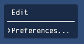
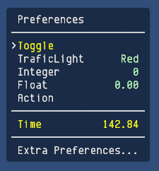

# Debug Menu

It is easy to use, lightweight library forked from [wataru-ito/DebugMenu](https://github.com/wataru-ito/DebugMenu) but deeply modifyed.

Renders text only in game debug menu.  

```C#

// The fields to modify by menu
public bool toggleValue;
public int integerValue;
public float floatValue;
        
// Create new menu
new DebugMenu("Edit/Preferences");
new DebugMenuToggle("Edit/Preferences/Toggle", () => toggleValue, value => toggleValue = value, 1);
new DebugMenuInteger("Edit/Preferences/Integer", () => integerValue, value => integerValue = value, 1);
new DebugMenuFloat("Edit/Preferences/Float", () => floatValue, value => floatValue = value, 1);
new DebugMenuAction("Edit/Preferences/Action", (item,tag) => { Debug.Log("Action"); }, 1);
new DebugMenuEnum<TrafficLight>("Edit/Preferences/TraficLight", () => enumValue, value => enumValue = value, 1);
new DebugMenu("Edit/Preferences/Extra Preferences", 2);
```





## Enum values

```C#
public enum TrafficLight { Red,Green, Blue }
public TrafficLight enumValue;

new DebugMenuEnum<TrafficLight>("Edit/Preferences/TraficLight", () => enumValue, value => enumValue = value, 1);
```

## Events

```C#
public enum EvenTag
{
    Null,               //< Nothing 
    Render,             //< Render item, update label, value and colors
    Dec,                //< Decrease value or call action
    Inc,                //< Increase value or call action
    Prev,               //< Go to previous item 
    Next,               //< Go to next item
    Reset,              //< Reset value to default
    Shift = 1024        //< Alternate behaviour with shift button
}
```
## Actions

The action code can update the menu item fields, and customly response for events: Inc,Dec and Reset
```C#
new DebugMenuAction("Edit/Preferences/Action", (item,tag) => { 
        switch (tag)
        {
        case EventTag.Inc:
           item.value = "Inc";
           break;
        case EventTag.Dec:
           item.value = "Dec";
           break;
        ...
        }
}, 1);
```

## Keyboard Shortcuts

E show hide menu
ESC close current menu and display previous, or hide menu
W,S move previous and next menu item
A,D edit menu item
R reset value to default

## Colors

- booleans
  - yellow _color of label for enabed feture_
  - white _color of label for disabled feature_
- integers,floats,enums
  - bright green _color of value for default_ 
  - yellow _color of value and label for not default value_
- actions
  - gray _color for inactive action_
  - other _color for active action_ 
